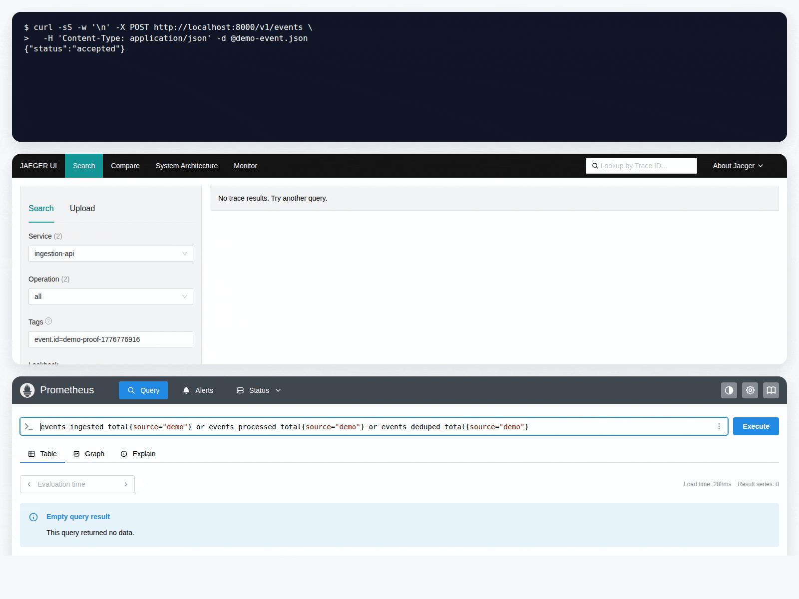
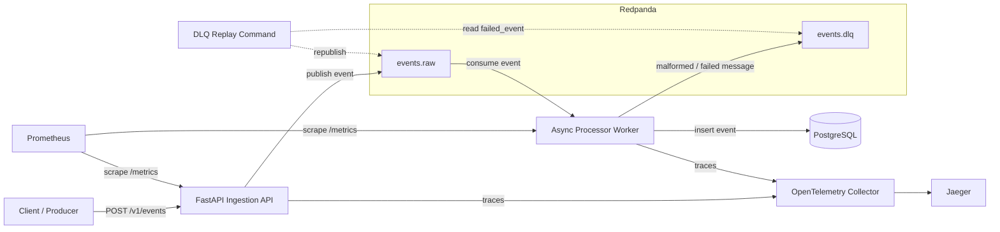
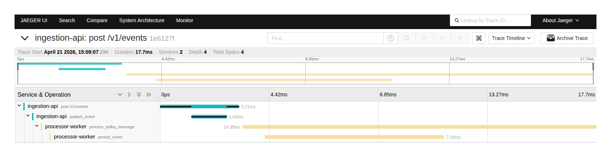
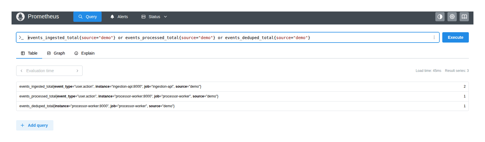
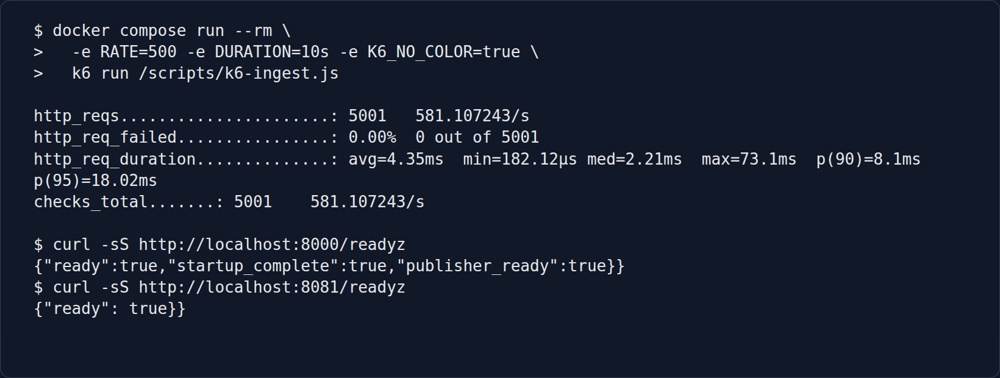

# Event Processing Platform

Async event-processing platform built with FastAPI, Redpanda (Kafka-compatible),
PostgreSQL, Prometheus, OpenTelemetry, and Jaeger.

[](https://github.com/arnaud-desclouds/event-processing-platform/actions/workflows/ci.yml)
[](.github/workflows/ci.yml)
[](pyproject.toml)
[](pyproject.toml)
[](#verification)
[](https://fastapi.tiangolo.com/)
[](https://www.redpanda.com/)
[](https://www.postgresql.org/)
[](https://docs.docker.com/compose/)
[](https://opentelemetry.io/)

## Tech Stack

- `API:` FastAPI, Pydantic
- `Messaging:` Redpanda (Kafka-compatible broker)
- `Persistence:` PostgreSQL, asyncpg, Alembic
- `Observability:` Prometheus, OpenTelemetry, Jaeger
- `Tooling:` Docker Compose, Pytest, Ruff, MyPy, Pyright, GitHub Actions

## Overview

This local event-processing stack accepts external events, processes them
asynchronously, handles duplicate delivery, and keeps failures easy to inspect.

## What It Does

- Accepts validated `POST /v1/events` requests through a FastAPI ingestion API
- Publishes events to a Redpanda broker and processes them
  with an async worker
- Enforces idempotent writes so duplicate events are accepted but stored once
- Routes malformed or failed messages to a DLQ with replay tooling
- Includes Prometheus metrics, distributed traces, Docker Compose, CI, static
  checks, and Docker-backed end-to-end tests

## Local Verification

- Duplicate replay check: `2` events ingested, `1` processed, `1` deduped, and
  `1` stored PostgreSQL row
- Short local Docker smoke load: one captured `k6` run sent `5,000+` requests
  over `10s` with `0.00%` HTTP failures
- Jaeger traces show the API request, broker publish path, worker processing,
  and database persistence span
- The repo includes the local Docker stack, CI, static checks, and
  Docker-backed e2e tests

## Local Demo

The GIF below was captured from the live local stack. It shows two duplicate
event submissions, matching Jaeger request traces, final Prometheus
`events_deduped_total` metrics, and the PostgreSQL result showing one stored row.



## Design Notes

- Delivery is at least once, so duplicate messages are expected and tested.
- PostgreSQL owns idempotency through a unique `event_id` constraint.
- Malformed or failed messages go to `events.dlq`, with a replay command for
  recoverable entries.
- Metrics, readiness probes, and traces are included in the local stack.

For more detail, see
[Design Tradeoffs / Production Notes](docs/design-decisions.md).

## Known Limits

- Event contracts are validated locally, but there is no schema registry,
  compatibility policy, or versioned producer rollout process.
- Production may need `event_id` uniqueness scoped by tenant, source, or event
  type.
- Retry, backpressure, poison-message handling, and alerting are kept minimal
  in this local stack.
- DLQ replay exists, but it does not yet include rate limits, audit logs, batch
  controls, or operator approval.
- Demo metrics keep `source` and `event_type` labels for local visibility; in
  production, those producer-controlled labels should be allowlisted or removed.
- Observability includes metrics and traces, but not Grafana dashboards, alert
  rules, SLOs, log aggregation, or retention policies.
- The stack uses Docker Compose. It does not cover managed broker/database
  infrastructure, HA PostgreSQL, backups, restore testing, or secrets
  management.
- Outbox/inbox tables and transactional producer guarantees are not
  implemented.

## Architecture



Metrics and traces cover the API request, Redpanda publish and consume,
and the PostgreSQL insert.

## Captured Run

These screenshots were captured from the local Docker stack after the demo and
load smoke check.

- Jaeger shows a request trace filtered by the demo `event_id`
- Prometheus shows the duplicate demo result:
  `events_ingested_total=2`, `events_processed_total=1`, and
  `events_deduped_total=1`
- The captured load-test terminal shows `k6` and readiness output from the
  live local stack

<p align="center">
  
</p>

<p align="center">
  
</p>

<p align="center">
  
</p>

## Implementation Notes

- API receives `POST /v1/events`, trims and validates the event contract,
  rejects blank `event_id` / `type` / `source` plus null `payload`, and
  publishes to the `events.raw` topic
- Worker consumes from Redpanda, validates again, inserts
  into PostgreSQL, and sends malformed or failed messages to `events.dlq`
- At-least-once delivery model with idempotency enforced by a unique
  `event_id`
- Database migrations enforce required columns plus non-blank `event_id`,
  `type`, and `source` at rest
- Prometheus metrics and distributed traces cover API request handling,
  Redpanda publish, worker consume/process, and database writes
- DLQ replay tooling, local Docker Compose orchestration, a dedicated migration
  image, and CI are included

## Run Locally

### Requirements

- Docker and Docker Compose
- Python 3.12 for local linting and tests

### Start the stack

```bash
git clone git@github.com:arnaud-desclouds/event-processing-platform.git
cd event-processing-platform
cp .env.example .env
make up
```

`make up` builds the images, starts the Compose stack, creates topics, and runs
database migrations through the dedicated migration image. Topic bootstrap
retries and fails loudly if the required topics cannot be created or confirmed.

### Check service health

```bash
make ps
curl http://localhost:8000/healthz
curl http://localhost:8000/readyz
curl http://localhost:8081/readyz
```

- `GET /healthz` is the ingestion API liveness endpoint.
- `GET /readyz` on port `8000` returns `200` after the API has completed
  startup and a live Kafka topic metadata probe succeeds.
- `GET /readyz` on port `8081` returns `200` after the worker has started its
  PostgreSQL pool and Kafka clients.

### Send an event

```bash
curl -X POST http://localhost:8000/v1/events \
  -H "Content-Type: application/json" \
  -d '{
    "event_id":"demo-1",
    "timestamp":"2026-01-01T00:00:00Z",
    "source":"demo",
    "type":"user.action",
    "payload":{"action":"signup"}
  }'
```

The API accepts valid events with:

```json
{"status":"accepted"}
```

Events require `event_id`, a timezone-aware `timestamp`, `source`, `type`, and a
non-null `payload`. Text fields are trimmed and blank `event_id`, `source`, and
`type` values are rejected. The `payload` field accepts any non-null JSON shape
by design so producers can send domain-specific event details.

### Confirm the row in PostgreSQL

```bash
docker compose exec postgres psql -U events_user -d events
```

```sql
SELECT event_id, type, source, event_timestamp
FROM events
ORDER BY id DESC
LIMIT 5;
```

```text
event_id | type         | source | event_timestamp
---------+--------------+--------+-------------------------------
demo-1   | user.action  | demo   | 2026-01-01 00:00:00+00
```

### Useful commands

```bash
make up
make migrate
make down
make logs
make test
make lint
make typecheck
make test-e2e
make load
```

## Verification

Run the local checks with:

```bash
./.venv/bin/python -m ruff check services tests alembic
./.venv/bin/python -m mypy services/common services/processor_worker services/ingestion_api
./.venv/bin/python -m pyright services/common services/processor_worker services/ingestion_api
./.venv/bin/python -m pytest -q
```

GitHub Actions runs `./.venv/bin/python -m pytest -q`, which includes the same
unit, service, and Docker-backed end-to-end coverage.

## Reliability Notes

### Delivery model

Delivery is at least once. Duplicate events are handled by a uniqueness
constraint on `event_id`.

### Failure handling

The worker exits its consume loop on Kafka consume failures, commit failures,
and DLQ publish failures. Docker Compose restarts the worker container with
`restart: unless-stopped`.

The ingestion API retries transient Kafka producer startup failures before
failing hard, and Docker Compose restarts it with `restart: unless-stopped`.

Startup and shutdown clean up partially initialized resources so a failed boot
does not leave either service in a half-started state.

### DLQ replay

Malformed payloads and database failures are written to `events.dlq`. Use the
worker image to replay entries with a `failed_event` to the target topic:

```bash
docker compose run --rm processor-worker \
  python -m services.processor_worker.dlq_replay --from-beginning --commit-offsets
```

## Repo Layout

```text
services/
  common/              shared event schema
  ingestion_api/       FastAPI ingestion service
    Dockerfile         container packaging for API
    requirements.txt   service runtime dependencies
  processor_worker/    async worker and DLQ tooling
    Dockerfile         container packaging for worker
    requirements.txt   service runtime dependencies
alembic/               schema migrations and migration image
tests/
  e2e/                 Docker-backed end-to-end verification
  test_*.py            unit and service-level tests
observability/         Prometheus and OpenTelemetry config
load-tests/            k6 ingestion load script
```

## License

MIT
